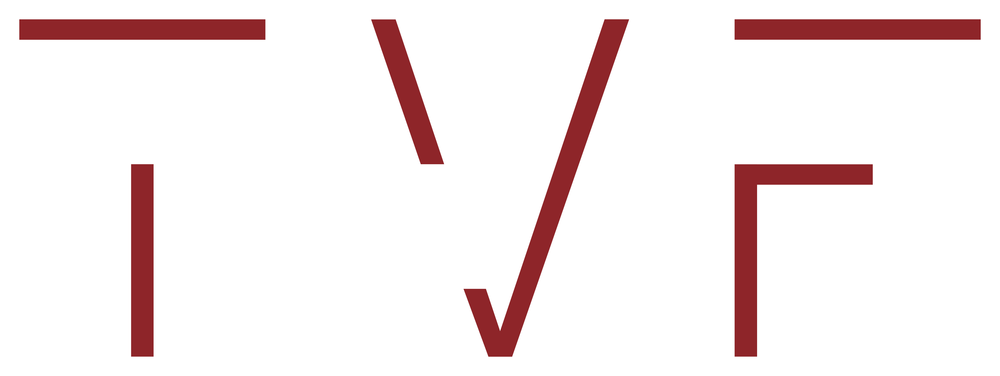

<!-- Logo in top right corner -->
<div align="right">
  
</div>

# 🚀 Startup Classifier App

Welcome to the **Startup Classifier App**! This application helps you classify companies from a public register as startups or non‑startups using a combination of weighted positive keywords, a no‑go list, and problematic names. It includes a smart learning mechanism that adjusts keyword weights over time based on your manual labels.

## ✨ Features

- **Smart Scoring:**  
  Computes a score for each company using weighted positive keywords and a no‑go list. If a company's name contains any problematic term (e.g., "Europe" or "Consulting"), it immediately gets a score of -100.

- **Smart Learning:**  
  When you label a company as a startup ("Yes"), the app increases the weight of the positive keywords found in its description. These adjustments persist across sessions via a JSON file.

- **Threshold‑Based Classification:**  
  Adjust the numeric threshold to flag companies for manual review. Lowering the threshold expands the pool of companies available for labeling without resetting manual labels.

- **Multiple Modes:**  
  - **Home:** Overview and instructions for the app.  
  - **Upload Data:** Upload and process a CSV file with company data.  
  - **Classification Interface:** Manually review and label companies with scores above the threshold.  
  - **View Classified Startups:** View and download the list of companies you've classified as startups.

- **User-Friendly Interface:**  
  The app features a logo, clear instructions, and visual indicators (progress bars, statistics) to guide you through the process.

## 📦 Installation

### Prerequisites
- Python 3.8 or higher

### Steps

1. **Clone the Repository:**
   ```bash
   git clone https://github.com/your-username/register-classification.git
   cd register-classification

2. **Create and Activate a Virtual Environment (Optional but Recommended):**
   ```bash
   python -m venv venv
   source venv/bin/activate  # On Windows: venv\Scripts\activate

4. **Install Dependencies:**
   ```bash
   pip install -r requirements.txt

## 🏃 Running the App Locally
    streamlit run app.py

## 🌐 Deployment

### Streamlit Community Cloud

**Deploy your app easily using Streamlit Community Cloud:**

1. Push your repository (with app.py, requirements.txt, and logo.png) to GitHub.

2. Log in to Streamlit Community Cloud and create a new app by selecting your repository and specifying app.py as the main module.

3. Click "Deploy" and your app will be live at a shareable URL.

## 📑 Project Structure

```bash
├── app.py                   # Main application code
├── requirements.txt         # List of dependencies (do NOT include 'os')
├── logo.png                 # Logo image (optional)
├── positive_weights.json    # Persistent file for positive keyword weights (created at runtime)
└── labeled_results.csv      # Stores user classifications (created at runtime)
